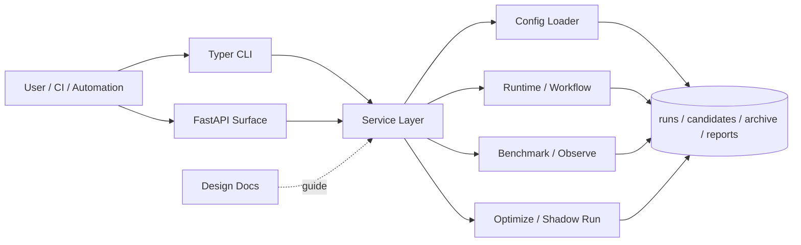

<div align="center">
  <h1>Meta-Harness</h1>
  <p>A reusable platform for continuously experimenting, comparing, and improving AI workflows. It records every attempt, automatically compares alternatives, and helps you find better execution strategies faster.</p>
  <p>
    
    
    
    
    
  </p>
  <p><a href="./README.md">中文</a></p>
  <p><a href="#quick-start">Quick Start</a> · <a href="./docs/research/paper-mapping.md">Paper Mapping</a> · <a href="./docs/guides/reproducibility.md">Reproducibility</a> · <a href="./docs/guides/open-source-release-checklist.md">Release Checklist</a></p>
</div>

## Research Background

This project originates from the paper [Meta-Harness: End-to-End Optimization of Model Harnesses](https://arxiv.org/abs/2603.28052). The core insight is that the effectiveness of large language model systems depends not only on the model itself, but also on the surrounding code that organizes information, retrieves context, formats prompts, and orchestrates execution — the harness. Rather than optimizing only prompts or single-turn outputs, the paper proposes treating the harness code itself as an optimization target, leveraging historical candidates, scores, and execution traces for outer-loop search.

This repository continues that direction, providing a reusable platform entry point for experiment orchestration, candidate management, benchmarking, tracing, and closed-loop optimization.

## What It Is

Meta-Harness is neither a one-off script nor a single-project temporary tool. It is a platform for continuously experimenting, comparing, and improving AI workflows.

Its core value lies in bringing different execution variants and their results under a unified management framework — giving experiment records, alternative comparisons, and iterative optimization a single entry point with clear context, rather than being scattered across ad-hoc scripts, command logs, and individual experience.

For AI automation, agent workflows, task execution systems, and other processes that require continuous tuning, this project provides a more systematic and reusable organizational approach.

## Highlights

- 🔥 **End-to-End Optimization Loop**: Organizes candidate, run, score, observe, benchmark, propose, and shadow-run into a continuous workflow, forming a stable closed loop across execution, evaluation, and iteration.
- 🚀 **Candidate-First Optimization**: Unifies configuration variants and code patches into a single candidate system, filtering better approaches through execution and evaluation results with a consistent comparison basis.
- 🌟 **Multi-Layer Workflow Management**: Supports platform defaults, workflow profiles, project overlays, and candidate patches simultaneously, enabling progressive convergence from generic capabilities to specific tasks.
- 🧠 **AI-Driven Optimization Proposals**: Generates next-round candidates based on historical execution results, failure traces, and proposal workflows, gradually shifting optimization from manual curation to automated progression.
- 🧩 **Modular Capability Units**: Benchmark, strategy cards, task sets, dataset extraction, and trace export can be composed independently, making it easy to extend and reuse across scenarios.
- 📊 **Benchmark-Driven Iteration**: Compares quality, stability, and cost across variants through repeatable benchmarks and suites, giving the optimization process clear quantitative grounding.
- 🌐 **Integration-Ready**: CLI-driven as the primary interface, with a service layer and API surface retained for future integration with automation systems, evaluation pipelines, and control planes.

## Problems It Solves

- Brings every experiment and execution result into traceable records, preventing optimization from relying on human memory
- Integrates execution, comparison, optimization, and archival into a single flow, reducing the management overhead of switching between multiple scripts and directories
- Enables different approaches to be re-executed and directly compared, grounding optimization decisions in verifiable results
- Maintains stable iteration capacity as workflow complexity grows, rather than repeatedly re-organizing the optimization process from scratch

## What You Can Do With It

- **Continuously optimize an AI assistant or agent**: When the same task admits multiple execution strategies, repeatedly experiment, compare results, and converge on a more stable and efficient approach.
- **Manage and compare different versions of AI workflows**: Whether changes come from prompts, process steps, or code logic, validate differences within a unified flow rather than relying on subjective judgment.
- **Establish reviewable experiment records for a team**: Preserve each attempt, result, and improvement direction, reducing the scattering of experiments across scripts, directories, and individual memory.

The repository already ships with runnable profiles, project overlays, task sets, benchmark specs, and strategy cards that serve as a practical foundation for these scenarios.

## Stability

Currently recommended as stable:

- CLI-driven `candidate → run → score → benchmark → propose → shadow-run` artifact loop
- Unified `mh optimize loop` offline search loop and `reports/loops/` iteration artifacts
- Dataset build / ingest / derive-split / promote path
- `demo_public` public demo and accompanying documentation
- File-system-as-truth artifact organization for runs, candidates, proposals, and reports

Currently considered experimental:

- HTTP API and async job surfaces are still converging
- Integration demos like `demo_openclaw` that depend on external runtimes
- White-box audit, gate policy, and external observability governance extensions
- Direct model-access proposers, more complete proposal registry, trace grading, and service consolidation

## Terminology

- `profile`: Default execution configuration for a category of workflows
- `project`: Lightweight override layer targeting a specific repository or scenario
- `candidate`: An executable harness variant, which may include config patches or code patches
- `proposal`: A next-round candidate suggestion that is not yet or just materialized
- `benchmark variant`: A single variant participating in a benchmark comparison
- `promotion`: The action of marking a dataset or candidate as higher priority / default
- `champion`: The candidate currently promoted as the default recommendation

## Architecture



## Quick Start

Requirements: Python 3.11+

```bash
python -m venv .venv
source .venv/bin/activate
pip install -e '.[dev]'
```

View CLI commands:

```bash
mh --help
```

If you prefer not to install the script entry point:

```bash
PYTHONPATH=src python -m meta_harness.cli --help
```

Minimal first steps:

```bash
PYTHONPATH=src python -m meta_harness.cli profile list

PYTHONPATH=src python -m meta_harness.cli --help
```

Next, choose a set of bundled assets from `configs/profiles/`, `configs/projects/`, and `task_sets/` to initialize and execute your first run.

## Documentation

For going deeper, the recommended reading order:

1. [Platform Design](./docs/architecture/platform-design.md)
2. [Data Model v1](./docs/architecture/data-model-v1.md)
3. [API Surface v1](./docs/architecture/api-surface-v1.md)

Additional references:

- [Documentation Index](./docs/README.md)
- [Artifact Contracts](./docs/reference/artifact-contracts.md)
- [Gate Policy v1](./docs/reference/gate-policy-v1.md)
- [Benchmark Spec v2](./docs/reference/benchmark-spec-v2.md)
- [External Strategy Evaluation](./docs/research/external-strategy-evaluation.md)
- [Paper Mapping](./docs/research/paper-mapping.md)
- [Reproducibility Guide](./docs/guides/reproducibility.md)
- [Open-Source Release Checklist](./docs/guides/open-source-release-checklist.md)
- [ADR Index](./docs/adr/README.md)

## Links

- [linux.do](https://linux.do) — Developer Community

## License

This project is licensed under the [MIT License](./LICENSE).

## Current Status

- The primary execution interface is the CLI
- HTTP API and service layer covering workflow, benchmark, integration, and optimize loop are provided
- The unified search loop backbone is in place — see `docs/architecture/search-loop-blueprint.md`
