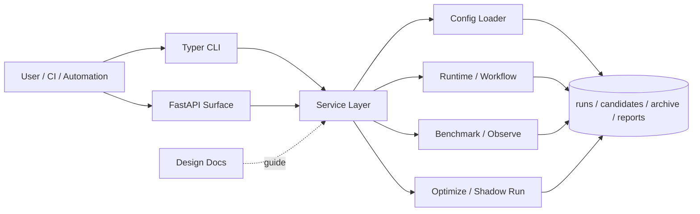

<div align="center">
  <h1>Meta-Harness</h1>
  <p>A platform for trying, comparing, and improving AI workflows. It records every attempt, compares alternatives automatically, and helps you find better ways to execute tasks faster.</p>
  <p>
    
    
    
    
    
  </p>
  <p><a href="./README.md">中文说明</a></p>
  <p><a href="#quick-start">Quick Start</a> · <a href="./docs/research/paper-mapping.md">Paper Mapping</a> · <a href="./docs/guides/reproducibility.md">Reproducibility</a> · <a href="./docs/guides/open-source-release-checklist.md">Open-Source Checklist</a></p>
</div>

## Research Background

This project is inspired by the paper [Meta-Harness: End-to-End Optimization of Model Harnesses](https://arxiv.org/abs/2603.28052). The paper argues that the performance of an LLM system depends not only on model weights, but also on the harness: the code that decides what information to store, retrieve, present, and execute around the model. Instead of optimizing only prompts or final outputs, the paper treats harness code itself as the optimization target and uses prior candidates, scores, and execution traces as the outer-loop search surface.

This repository extends that direction into a reusable platform entry point for experiment orchestration, candidate management, benchmarking, traces, and optimization loops.

## What It Is

Meta-Harness is not a one-off script, nor is it a temporary utility for a single project. It is a platform for continuously testing, comparing, and improving AI workflows.

Its core value is to bring different execution paths, variants, and results into a single operational framework, so that experiment records, comparison, and iterative optimization have one consistent entry point instead of being scattered across shell history, ad hoc scripts, and manual bookkeeping.

For AI automation, agent workflows, task execution systems, and other processes that require ongoing tuning, the project provides a more systematic and reusable way to organize that work.

## Highlights

- 🔥 **End-to-end optimization loop**: candidate, run, score, observe, benchmark, propose, and shadow-run are organized as one continuous workflow, allowing execution, evaluation, and iteration to operate as a stable loop.
- 🚀 **Candidate-first optimization model**: config variants and code patches are managed within the same candidate system, then filtered through execution and evaluation results on a consistent comparison basis.
- 🌟 **Multi-layer workflow control**: the platform supports platform defaults, workflow profiles, project overlays, and candidate patches, making it possible to narrow from reusable capabilities to task-specific execution.
- 🧠 **AI-driven proposal flow**: future candidates can be generated from historical results, failure traces, and proposal workflows, allowing optimization to move gradually from manual coordination toward automation.
- 🧩 **Modular capability blocks**: benchmarks, strategy cards, task sets, dataset extraction, and trace export remain independently composable, which improves reuse and scenario-specific extension.
- 📊 **Benchmark-driven iteration**: repeatable benchmarks and suites provide a quantitative basis for comparing quality, stability, and cost across variants.
- 🌐 **Designed for integration and extension**: the CLI is the primary entry point today, while the service layer and API surface preserve a foundation for future automation, evaluation pipelines, and control-plane integration.

## What Problem It Solves

- it keeps each experiment and execution result traceable, reducing reliance on manual memory during optimization
- it unifies execution, comparison, optimization, and archiving in one flow, lowering the overhead of managing scattered scripts and directories
- it allows alternative approaches to be rerun and compared directly, so optimization decisions can be grounded in verifiable results
- it preserves iteration discipline as workflows become more complex, instead of forcing teams to rebuild the process manually each time

## What You Can Do With It

- continuously improve an AI assistant or agent: when the same task can be executed in different ways, the platform helps compare outcomes and move toward a more stable and effective approach
- manage and compare different versions of an AI workflow: whether the change comes from prompts, workflow steps, or code logic, the differences can be validated in one consistent process
- build a reusable experiment record for a team: each attempt, result, and improvement direction can be preserved, reducing reliance on scattered scripts, folders, and memory

The repository already contains runnable profiles, project overlays, task sets, benchmark specs, and strategy cards, which provide a practical foundation for these scenarios.

## Stability

The parts that are reasonable to treat as stable in the current public release are:

- the CLI-driven `candidate -> run -> score -> benchmark -> propose -> shadow-run` artifact loop
- the unified `mh optimize loop` offline search loop and its `reports/loops/` iteration artifacts
- the dataset build / ingest / derive-split / promote lifecycle
- the `demo_public` open demo flow and its supporting docs
- the filesystem-first organization of runs, candidates, proposals, and reports

The parts that should still be treated as experimental are:

- the HTTP API and async job product surface
- integration demos such as `demo_openclaw` that depend on external runtimes
- white-box audit, gate policy, and external observability governance extensions
- direct model-backed proposers, fuller proposal registry, trace grading, and service-surface convergence

## Glossary

- `profile`: the default execution shape for a workflow family
- `project`: a lightweight override layer for one repository or scenario
- `candidate`: an executable harness variant, potentially including config or code patches
- `proposal`: a suggested next-step variant before or during materialization
- `benchmark variant`: one concrete variant inside a benchmark comparison
- `promotion`: the act of elevating a dataset or candidate for preferred use
- `champion`: the candidate currently promoted as the recommended default

## Architecture



## Quick Start

Requirement: Python 3.11+

```bash
python -m venv .venv
source .venv/bin/activate
pip install -e '.[dev]'
```

Inspect the CLI:

```bash
mh --help
```

If you do not want to install the script entry point yet, run it directly:

```bash
PYTHONPATH=src python -m meta_harness.cli --help
```

Minimal path to try the platform:

```bash
PYTHONPATH=src python -m meta_harness.cli profile list

PYTHONPATH=src python -m meta_harness.cli --help
```

From there, choose an existing set of assets from `configs/profiles/`, `configs/projects/`, and `task_sets/`, then initialize and execute your first run.

## Documentation Entry Points

If you want the deeper technical view instead of the landing-page summary, read these first:

1. [Platform Design](./docs/architecture/platform-design.md)
2. [Data Model v1](./docs/architecture/data-model-v1.md)
3. [API Surface v1](./docs/architecture/api-surface-v1.md)

Additional references:

- [Docs Index](./docs/README.md)
- [Artifact Contracts](./docs/reference/artifact-contracts.md)
- [Gate Policy v1](./docs/reference/gate-policy-v1.md)
- [Benchmark Spec v2](./docs/reference/benchmark-spec-v2.md)
- [External Strategy Evaluation](./docs/research/external-strategy-evaluation.md)
- [Paper Mapping](./docs/research/paper-mapping.md)
- [Reproducibility Guide](./docs/guides/reproducibility.md)
- [Open-Source Release Checklist](./docs/guides/open-source-release-checklist.md)
- [ADR Index](./docs/adr/README.md)

## Current Status

- the CLI is the primary execution surface today
- the repository already ships an HTTP API and reusable service layer covering workflow, benchmark, integration, and optimize-loop flows
- the unified search-loop path is implemented; see `docs/architecture/search-loop-blueprint.md`
- bearer-token API auth is available, while broader workspace and permission modeling is still pending
- the repository is now released under the `MIT` license; see `LICENSE`
