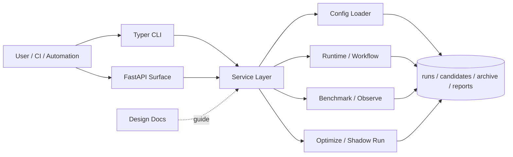

<div align="center">
  <h1>Meta-Harness</h1>
  <p>An artifact-first control-plane kernel for optimizing AI workflows.</p>
  <p>
    
    
    
    
    
    
  </p>
  <p><a href="./README.md">中文</a></p>
  <p><a href="#30-second-demo">30-Second Demo</a> · <a href="#quick-start">Quick Start</a> · <a href="./docs/research/paper-mapping.md">Paper Mapping</a> · <a href="./docs/guides/reproducibility.md">Reproducibility</a> · <a href="./docs/README.md">Docs Index</a></p>
</div>

## What It Is

Meta-Harness is not a one-off script and not a temporary tool for a single repository. It is an artifact-first platform kernel for AI workflow optimization: candidate, run, score, benchmark, proposal, shadow-run, and trace export all live in the same replayable, comparable, archivable system.

The repository is an engineering implementation of the paper [Meta-Harness: End-to-End Optimization of Model Harnesses](https://arxiv.org/abs/2603.28052). It keeps the paper's outer-loop optimization idea intact, while adding contracts, export surfaces, lightweight product scaffolding, and governance semantics so the result is more than a collection of experiment scripts.

## Why It Is Worth Looking At

- It turns workflow optimization from ad hoc judgment into a replayable artifact flow.
- It already ships a real closed loop: `candidate -> run -> score -> benchmark -> propose -> shadow-run`.
- It is more than a CLI scaffold: the repo includes a FastAPI surface, request envelopes, and an evolving product-facing skeleton that can be extended into a reusable platform kernel.

## Who It Is For

- Teams continuously tuning AI assistants, agents, or task workflows
- Research-engineering readers who want experiment records, comparisons, and iteration inside one traceable system
- Developers who want to extend the paper's ideas into a reusable platform kernel instead of rebuilding control-plane basics from scratch

## 30-Second Demo

If you only want to answer “does this repository actually run a full loop?”, use the public demo:

```bash
python -m venv .venv
source .venv/bin/activate
pip install -e '.[dev]'

bash scripts/demo_public_flow.sh .demo-output
```

That single script walks through:

- `run init`
- `run execute`
- `optimize propose --proposal-only`
- `optimize materialize-proposal`
- `dataset build-task-set`
- `dataset ingest-annotations`
- `dataset derive-split`
- `dataset promote`
- `run export-trace`
- `optimize loop`
- `observe benchmark`
- `artifact contract validator`

Artifacts are written to:

- `.demo-output/runs`
- `.demo-output/candidates`
- `.demo-output/proposals`
- `.demo-output/datasets`
- `.demo-output/reports/benchmarks/demo_public_budget_headroom.json`
- `.demo-output/reports/loops/<loop_id>/`
- `.demo-output/exports/<run_id>.otel.json`

The script also prints `run_id`, `proposal_id`, `materialized_candidate_id`, `loop_id`, and key artifact paths for quick validation. For the longer walkthrough, see [Reproducibility](./docs/guides/reproducibility.md).

## Core Capabilities

- Closed-loop optimization with a shared artifact contract
- Candidate management for both config patches and code patches
- Dataset lifecycle covering build, annotation ingestion, derive-split, and promotion
- OTLP / Phoenix / Langfuse request envelopes with integration export artifacts
- `lineage-first` governance semantics for candidate and loop artifacts
- Experimental product skeletons for workspace auth context, queued worker path, SQLite projection store, and embedded dashboard shell

## Current Boundaries

Recommended as stable today:

- CLI-driven `candidate -> run -> score -> benchmark -> propose -> shadow-run` artifact flow
- Unified `mh optimize loop` offline search loop and `reports/loops/` iteration artifacts
- Dataset build / ingest / derive-split / promote path
- `demo_public` and its supporting documentation
- File-system-as-truth organization for runs, candidates, proposals, and reports

Still experimental:

- Protocol-grade OTLP transport
- Official Phoenix / Langfuse SDK or hosted API integrations
- Multi-workspace and role-based authorization
- Real background queue scheduling, lease, and recovery
- Projection-store integration into the main query path
- Deeper lineage / trace / export drill-down inside the dashboard

## Architecture



## Quick Start

Requirements: Python 3.11+

```bash
python -m venv .venv
source .venv/bin/activate
pip install -e '.[dev]'
```

View the CLI:

```bash
mh --help
```

If you prefer not to install the script entry point:

```bash
PYTHONPATH=src python -m meta_harness.cli --help
PYTHONPATH=src python -m meta_harness.cli profile list
```

## Documentation

Recommended reading order:

1. [Platform Design](./docs/architecture/platform-design.md)
2. [Data Model v1](./docs/architecture/data-model-v1.md)
3. [Artifact Contracts](./docs/reference/artifact-contracts.md)
4. [API Surface v1](./docs/architecture/api-surface-v1.md)
5. [Reproducibility Guide](./docs/guides/reproducibility.md)
6. [Paper Mapping](./docs/research/paper-mapping.md)

Additional references:

- [Documentation Index](./docs/README.md)
- [Benchmark Spec v2](./docs/reference/benchmark-spec-v2.md)
- [Gate Policy v1](./docs/reference/gate-policy-v1.md)
- [External Strategy Evaluation](./docs/research/external-strategy-evaluation.md)
- [ADR Index](./docs/adr/README.md)

Maintainer references:

- [Open-Source Release Checklist](./docs/guides/open-source-release-checklist.md)
- [Release Materials Pack](./docs/guides/release-materials-pack.md)

## Terminology

- `profile`: default execution configuration for a class of workflows
- `project`: lightweight override layer for a specific repository or scenario
- `candidate`: an executable harness variant, including config or code patches
- `proposal`: a suggested next-round candidate that is not yet or just materialized
- `benchmark variant`: one variant participating in a benchmark comparison
- `promotion`: the act of marking a dataset or candidate as higher-priority or default
- `champion`: the currently promoted default candidate

## License

This project is released under the [MIT License](./LICENSE).
