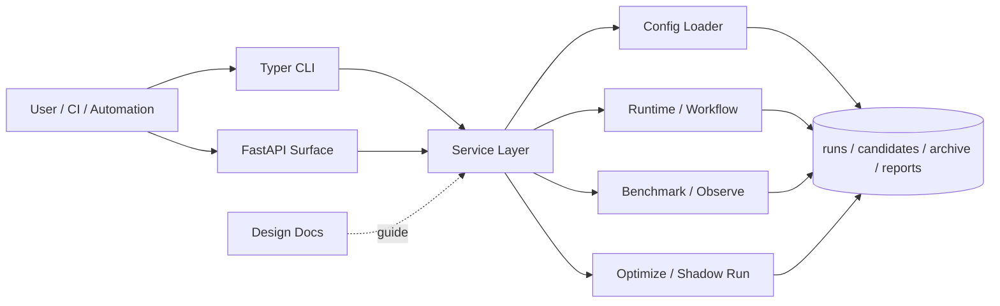

<div align="center">
  <h1>Meta-Harness</h1>
  <p>一个把 AI workflow 优化过程落成可回放 artifact 的控制面内核。</p>
  <p>
    
    
    
    
    
    
  </p>
  <p><a href="./README.en.md">English</a></p>
  <p><a href="#30-秒-demo">30 秒 Demo</a> · <a href="#快速开始">快速开始</a> · <a href="./docs/research/paper-mapping.md">论文映射</a> · <a href="./docs/guides/reproducibility.md">复现指南</a> · <a href="./docs/README.md">文档索引</a></p>
</div>

## 这是什么

Meta-Harness 不是一次性脚本，也不是只服务单一项目的临时工具。它是一个面向 AI workflow 优化的 artifact-first 平台内核：把 candidate、run、score、benchmark、proposal、shadow-run 和 trace export 纳入同一套可回放、可比较、可归档的产物体系。

这个仓库来自论文 [Meta-Harness: End-to-End Optimization of Model Harnesses](https://arxiv.org/abs/2603.28052) 的工程化实现。它保留论文最核心的外层优化循环，同时补上配置、数据模型、导出、最小产品面和治理语义，让它不只是实验脚本，而是可以继续扩展的平台骨架。

## 为什么值得看

- 它把“优化 prompt / workflow / harness”这件事从经验操作变成可回放 artifact 流程。
- 它已经具备一条真实闭环：`candidate -> run -> score -> benchmark -> propose -> shadow-run`。
- 它不只是一组 CLI 脚本：仓库已经提供 FastAPI surface、request envelope，以及一层仍在演进中的产品化骨架，便于继续向平台内核扩展。

## 适合谁

- 想持续优化 AI 助手、Agent 或任务工作流的工程团队
- 想把实验记录、比较和迭代统一到一套可追溯产物中的研究工程读者
- 想基于论文思想继续做平台化扩展，而不是从零搭控制面的开发者

## 30 秒 Demo

如果你只想确认这个仓库是不是“真能跑”，最短路径就是直接跑公开 demo：

```bash
python -m venv .venv
source .venv/bin/activate
pip install -e '.[dev]'

bash scripts/demo_public_flow.sh .demo-output
```

这条脚本会串起一次完整闭环，依次经过：

- `run init`
- `run execute`
- `optimize propose --proposal-only`
- `optimize materialize-proposal`
- `dataset build-task-set`
- `dataset ingest-annotations`
- `dataset derive-split`
- `dataset promote`
- `run export-trace`
- `optimize loop`
- `observe benchmark`
- `artifact contract validator`

跑完后，你会直接得到这几类产物：

- `.demo-output/runs`
- `.demo-output/candidates`
- `.demo-output/proposals`
- `.demo-output/datasets`
- `.demo-output/reports/benchmarks/demo_public_budget_headroom.json`
- `.demo-output/reports/loops/<loop_id>/`
- `.demo-output/exports/<run_id>.otel.json`

脚本标准输出还会打印 `run_id`、`proposal_id`、`materialized_candidate_id`、`loop_id` 和关键 artifact 路径，适合快速核对结果。更完整说明见 [复现指南](./docs/guides/reproducibility.md)。

## 核心能力

- 闭环优化：candidate、run、score、benchmark、proposal、shadow-run 使用统一 artifact contract。
- 候选管理：配置 patch 和代码 patch 都可以进入同一 candidate 体系。
- 数据集飞轮：支持 dataset build、annotation ingestion、derive-split、promotion。
- 导出与集成：支持 OTLP / Phoenix / Langfuse 的 request envelope 与 integration export artifact。
- 治理语义：`lineage-first` 的 candidate / loop artifact 语义已落地。
- 实验性产品骨架：已具备 `WorkspaceAuthContext`、queued worker 最小路径、SQLite projection store、内嵌 dashboard shell。

## 当前边界

当前建议作为稳定能力使用的部分：

- CLI 驱动的 `candidate -> run -> score -> benchmark -> propose -> shadow-run` artifact 流程
- `mh optimize loop` 离线 search loop 与 `reports/loops/` 迭代工件
- dataset 的 build / ingest / derive-split / promote 路径
- `demo_public` 公开 demo 及其配套文档
- 文件系统作为事实源的 runs / candidates / proposals / reports 产物组织

当前仍应视为 experimental 的部分：

- OTLP 真正协议级 transport
- Phoenix / Langfuse 的正式 SDK / hosted API 适配
- 多 workspace / 多角色权限模型
- 真正后台 worker / lease / recovery / queue 调度
- DB projection 接入主查询链路
- dashboard 的更深层 lineage / trace / export drill-down

## 架构图



## 快速开始

环境要求：Python 3.11+

```bash
python -m venv .venv
source .venv/bin/activate
pip install -e '.[dev]'
```

查看 CLI：

```bash
mh --help
```

如果暂时不安装脚本入口，也可以直接运行：

```bash
PYTHONPATH=src python -m meta_harness.cli --help
PYTHONPATH=src python -m meta_harness.cli profile list
```

## 文档入口

建议按这个顺序读：

1. [平台设计](./docs/architecture/platform-design.md)
2. [Data Model v1](./docs/architecture/data-model-v1.md)
3. [Artifact Contracts](./docs/reference/artifact-contracts.md)
4. [API Surface v1](./docs/architecture/api-surface-v1.md)
5. [复现指南](./docs/guides/reproducibility.md)
6. [论文映射](./docs/research/paper-mapping.md)

补充文档：

- [文档索引](./docs/README.md)
- [Benchmark Spec v2](./docs/reference/benchmark-spec-v2.md)
- [Gate Policy v1](./docs/reference/gate-policy-v1.md)
- [External Strategy Evaluation](./docs/research/external-strategy-evaluation.md)
- [ADR Index](./docs/adr/README.md)

维护者参考：

- [开源发布 Checklist](./docs/guides/open-source-release-checklist.md)
- [对外发布素材包](./docs/guides/release-materials-pack.md)

## 术语

- `profile`：一类工作流的默认执行配置
- `project`：针对某个仓库或场景的轻量覆写层
- `candidate`：一个可执行的 harness 变体，可以包含配置 patch 或代码 patch
- `proposal`：尚未或刚被物化的下一轮候选建议
- `benchmark variant`：benchmark 中参与比较的单个变体
- `promotion`：把数据集或 candidate 标记为更高优先级/默认对象的动作
- `champion`：当前被提升为默认推荐的 candidate

## License

本项目基于 [MIT License](./LICENSE) 开源。
