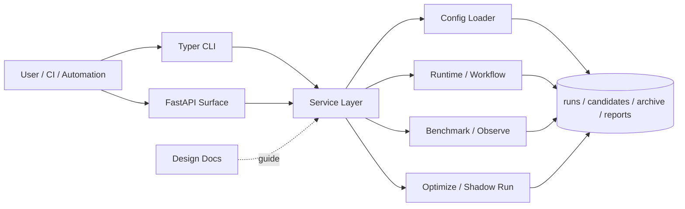

<div align="center">
  <h1>Meta-Harness</h1>
  <p>一个帮助你持续试验、比较和改进 AI 工作流的平台。它会记录每一次尝试，自动比较不同方案，并帮助你更快找到更好的执行方式。</p>
  <p>
    
    
    
    
    
  </p>
  <p><a href="./README.en.md">English</a></p>
  <p><a href="#快速开始">快速开始</a> · <a href="./docs/research/paper-mapping.md">论文映射</a> · <a href="./docs/guides/reproducibility.md">复现指南</a> · <a href="./docs/guides/open-source-release-checklist.md">开源 Checklist</a></p>
</div>

## 研究背景

这个项目的起点来自论文 [Meta-Harness: End-to-End Optimization of Model Harnesses](https://arxiv.org/abs/2603.28052)。论文的核心观点是：大型语言模型系统的效果，不仅取决于模型本身，也取决于围绕模型的信息组织、检索、呈现和执行代码，也就是 harness。相比只优化 prompt 或单轮输出，论文提出把 harness 代码本身作为优化对象，并利用历史候选、评分和执行轨迹做外层搜索。

当前仓库延续了这个方向，把实验编排、候选管理、benchmark、trace 和优化闭环落成一个可复用的平台入口。

## 它是什么

Meta-Harness 不是一次性脚本，也不是只面向单一项目的临时工具。它是一个用于持续试验、比较和改进 AI 工作流的平台。

它的核心价值在于，将执行过程中的不同方案、变体和结果纳入同一套管理框架，使实验记录、方案比较和迭代优化具备统一的入口与清晰的上下文，而不再分散在零散脚本、命令记录和人工经验之中。

对于 AI 自动化、Agent 工作流、任务执行系统，以及其他需要持续调优的流程，这个项目提供了一种更系统、更可复用的组织方式。

## 亮点

- 🔥 **端到端优化闭环**：将 candidate、run、score、observe、benchmark、propose 和 shadow-run 组织为一条连续工作流，使执行、评估和迭代形成稳定闭环。
- 🚀 **候选优先的优化机制**：将配置变体和代码 patch 统一纳入候选体系，并通过执行与评估结果筛选更优方案，使优化过程具备一致的比较基础。
- 🌟 **多层工作流管理**：同时支持 platform defaults、workflow profile、project overlay 和 candidate patch，便于从通用能力逐步收敛到具体任务。
- 🧠 **AI 驱动的优化提案**：可基于历史执行结果、失败轨迹和 proposal workflow 生成下一轮候选，使优化逐步从人工整理转向自动化推进。
- 🧩 **模块化能力单元**：benchmark、strategy card、task set、dataset extraction 和 trace export 等能力可独立组合，便于按场景扩展和复用。
- 📊 **Benchmark 驱动迭代**：通过可重复 benchmark 和 suite 比较不同变体的质量、稳定性和成本，使优化过程具备明确的量化依据。
- 🌐 **面向集成与扩展**：当前以 CLI 为主要入口，同时保留 service 层和 API surface，为后续接入自动化系统、评测管线和控制平面提供基础边界。

## 它解决什么问题

- 将每一次实验和执行结果纳入可追踪记录，避免优化过程依赖人工记忆
- 将执行、比较、优化和归档整合到同一条流程中，降低多脚本和多目录切换带来的管理成本
- 让不同方案能够被重复执行和直接比较，使优化决策建立在可验证结果之上
- 在工作流复杂度持续上升时，仍然保持稳定的迭代能力，而不是反复从零组织优化流程

## 你可以用它做什么

- 持续优化一个 AI 助手或 Agent：当同一个任务存在多种执行方式时，可以反复试验、比较结果，并逐步收敛到更稳定、更高效的方案。
- 管理和比较不同版本的 AI 工作流：无论变化来自提示词、流程步骤还是代码逻辑，都可以在统一流程中验证差异，而不是依赖主观判断。
- 为团队建立可复盘的实验记录：把每次尝试、结果和改进方向保留下来，减少实验过程散落在脚本、目录和人工记忆中的情况。

仓库当前已经具备可运行的 profile、project overlay、task set、benchmark spec 和 strategy card 资产，可作为这些场景的实际基础。

## 稳定性

当前建议作为稳定能力使用的部分：

- CLI 驱动的 `candidate -> run -> score -> benchmark -> propose -> shadow-run` artifact 流程
- 统一 `mh optimize loop` 离线搜索闭环，以及 `reports/loops/` 迭代工件
- dataset 的 build / ingest / derive-split / promote 路径
- `demo_public` 公开 demo 及其配套文档
- 以文件系统为真相源的 runs / candidates / proposals / reports 产物组织

当前仍应视为 experimental 的部分：

- 部分 HTTP API / async job 产品面仍在收敛
- `demo_openclaw` 这类依赖外部运行时的集成 demo
- white-box audit、gate policy、外部 observability 的扩展治理能力
- 直接模型接入的 proposer、更完整的 proposal registry、trace grading 与服务化收口

## 术语

- `profile`：一类工作流的默认执行配置
- `project`：针对某个仓库或场景的轻量覆写层
- `candidate`：一个可执行的 harness 变体，可以包含配置 patch 或代码 patch
- `proposal`：尚未或刚被物化的下一轮候选建议
- `benchmark variant`：benchmark 中参与比较的单个变体
- `promotion`：把数据集或 candidate 标记为更高优先级/默认对象的动作
- `champion`：当前被提升为默认推荐的 candidate

## 架构图



## 快速开始

环境要求：Python 3.11+

```bash
python -m venv .venv
source .venv/bin/activate
pip install -e '.[dev]'
```

查看 CLI：

```bash
mh --help
```

如果暂时不安装脚本入口，也可以直接运行：

```bash
PYTHONPATH=src python -m meta_harness.cli --help
```

最小体验路径：

```bash
PYTHONPATH=src python -m meta_harness.cli profile list

PYTHONPATH=src python -m meta_harness.cli --help
```

接下来从 `configs/profiles/`、`configs/projects/` 和 `task_sets/` 中选择一组仓库内已有资产，初始化并执行你的第一条 run。

## 文档入口

如果你要继续深入，而不是只停留在首页，建议按这个顺序读：

1. [平台设计](./docs/architecture/platform-design.md)
2. [Data Model v1](./docs/architecture/data-model-v1.md)
3. [API Surface v1](./docs/architecture/api-surface-v1.md)

其他文档：

- [文档索引](./docs/README.md)
- [Artifact Contracts](./docs/reference/artifact-contracts.md)
- [Gate Policy v1](./docs/reference/gate-policy-v1.md)
- [Benchmark Spec v2](./docs/reference/benchmark-spec-v2.md)
- [External Strategy Evaluation](./docs/research/external-strategy-evaluation.md)
- [论文映射](./docs/research/paper-mapping.md)
- [复现指南](./docs/guides/reproducibility.md)
- [开源发布 Checklist](./docs/guides/open-source-release-checklist.md)
- [ADR Index](./docs/adr/README.md)

## 当前状态

- 当前主要执行入口是 CLI
- 已提供覆盖 workflow、benchmark、integration 和 optimize loop 的 HTTP API / service 层
- 统一 search loop 主轴已落地，详见 `docs/architecture/search-loop-blueprint.md`
- 仓库当前采用 `MIT` 许可证，见 `LICENSE`
